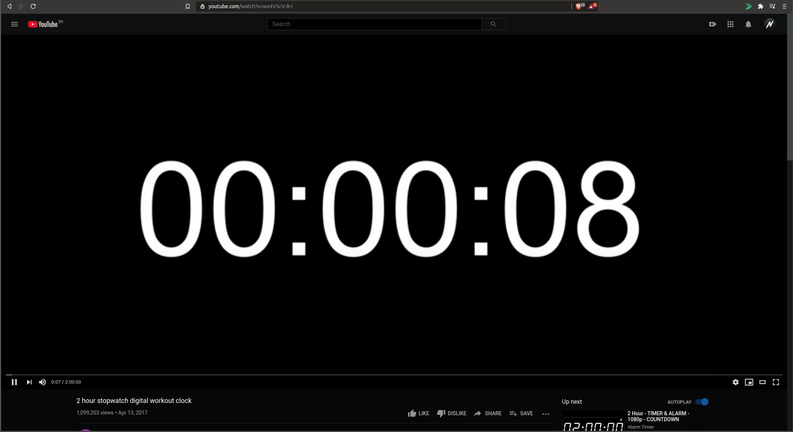

# QuickVid (Chrome / Chromium)

QuickVid

  <!--  -->

## Installation

- First Download the extension clicking here => (https://github.com/lnardon/QuickVid/archive/master.zip)
- Unzip the pack and go to your chrome extensions tab
- Enable Developer Mode on the page
- Click on the "Load Unpacked" Button and choose the folder of the extension

@lnardon 2020 
Any contibuition is Welcome
